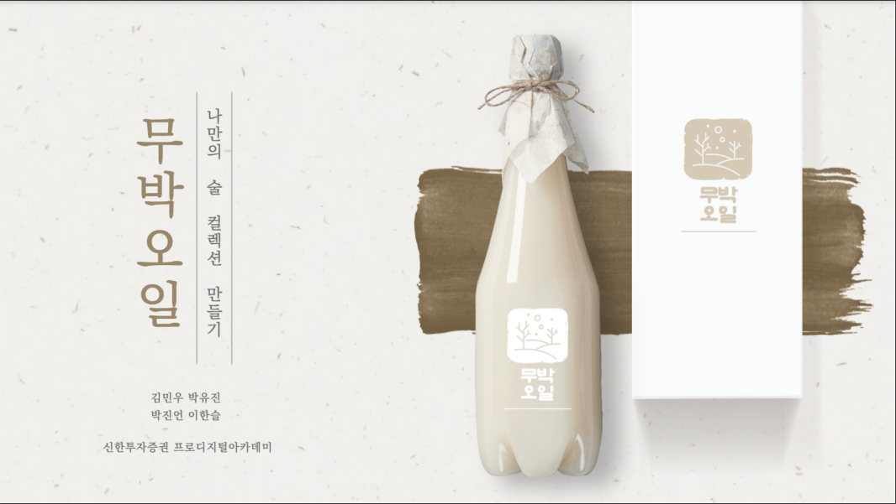

 

### 📋 프로젝트 개요

> **프로젝트명** : 무박오일   **개발 기간** : 2024년 02월 16일 ~ 2024년 02월 29일 (10일)   **분류** : 팀 프로젝트   **팀 구성** : 프론트엔드 2명, 백엔드 2명 

 
 

### 🧑‍🤝‍🧑 팀 정보

| 이름   | 역할                 |
| ------ | --------------------|
| 김민우 | 데이터 분석, 배포      |
| 박유진 | FE 개발, UI/UX 디자인 |
| 박진언 | FE 개발, UI/UX 디자인 |
| 이한슬 | BE 개발              |

 
 

### 🔍 기획 배경

#### 다양한 종류의 전통주를 먹으며 어떤 지역의, 어떤 술을 먹었는지 한눈에 볼 수 있는 서비스를 만들고자 기획했습니다.

 
 

### 💡 주요 기능

> 지도

- 먹고 싶은 술이나 먹어본 술에 대해 좋아요를 눌러 위시리스트에 추가시, 지도(메인 페이지)에 해당 술의 양조장 정보를 기반으로 지도에 표시가 됩니다.

 

> 검색 (음식, 지역 태그)

- 음식과 지역 태그를 클릭 시, 해당 태그에 알맞는 술이 출력됩니다.
- 음식 태그는 받아온 데이터의 음식들을 미리 지정해놓은 태그 중 유사한 태그로 분리될 수 있도록 ChatGPT API를 사용하여 데이터를 전처리하였습니다.

 

> 위시리스트

- 술의 디테일 모달에서 좋아요를 누르면 나의 위시리스트에 추가됩니다.

 

> 디테일 / 리뷰

- 비로그인시 술의 정보들을 볼 수 있고, 로그인시 술의 정보뿐만 아니라 좋아요, 리뷰를 남기고 다른 유저들의 리뷰 또한 함께 볼 수 있습니다.

 
 

### ✨ 기능 화면

> 비로그인 시 메인 & 디테일 페이지

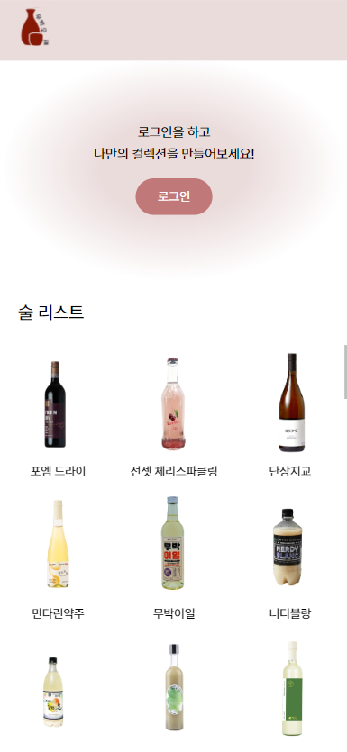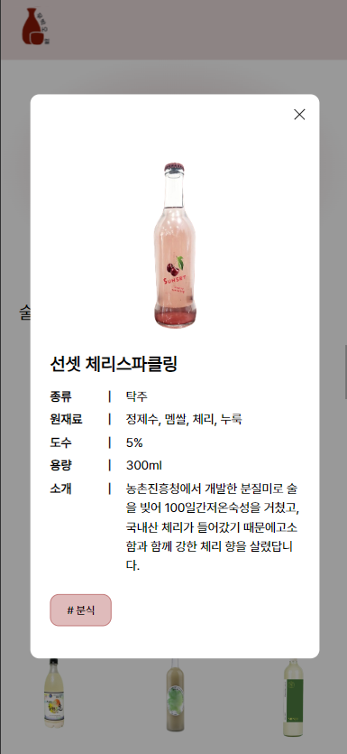
 
 

> 회원가입 / 로그인

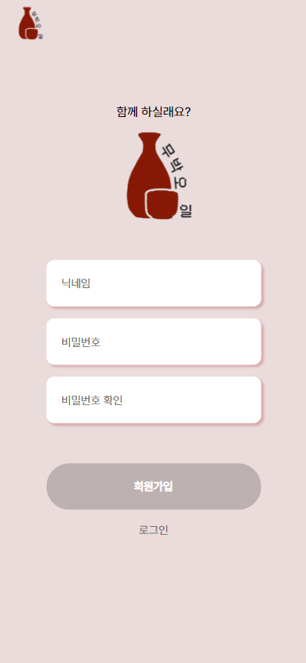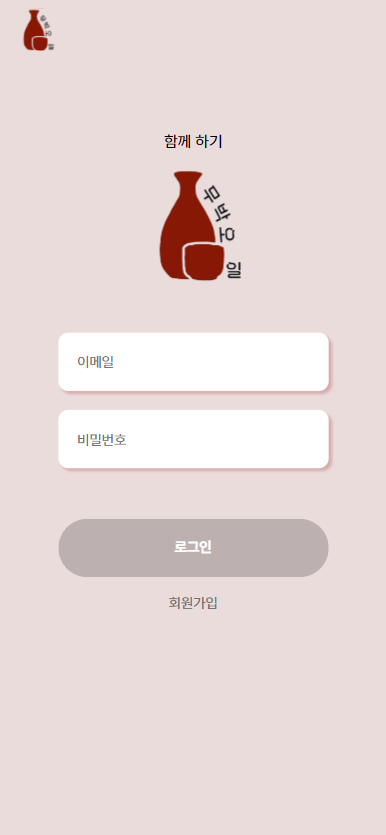
 
 

> 로그인 시 술 리스트 & 디테일 & 리뷰 페이지

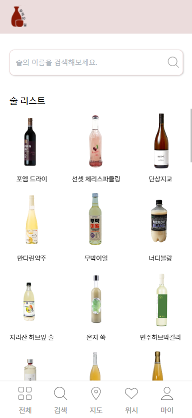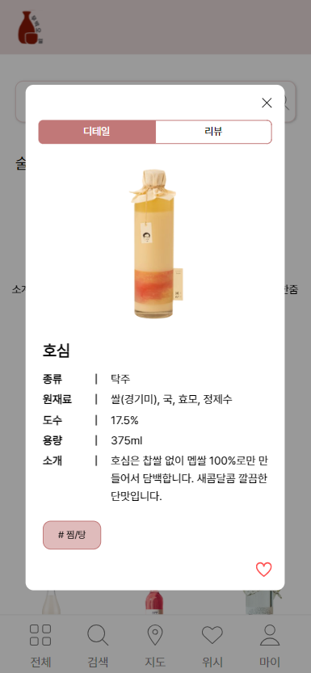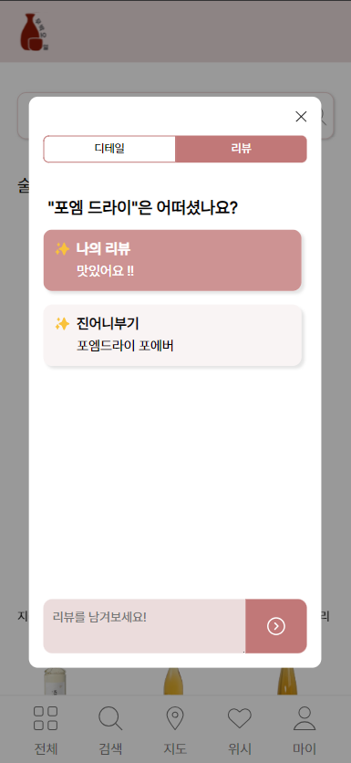
 
 

> 태그 및 도수 검색 페이지

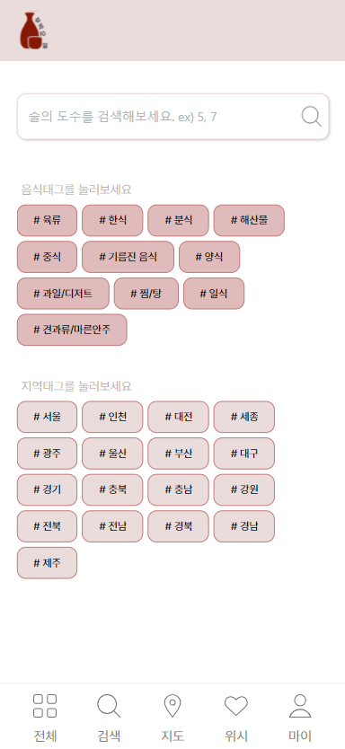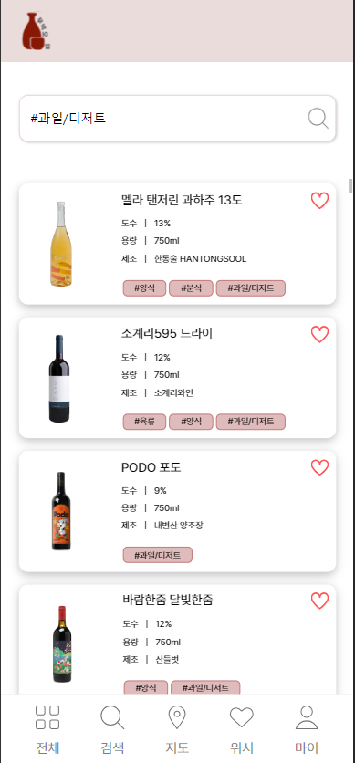
 
 

> 지도 페이지 (시, 도)

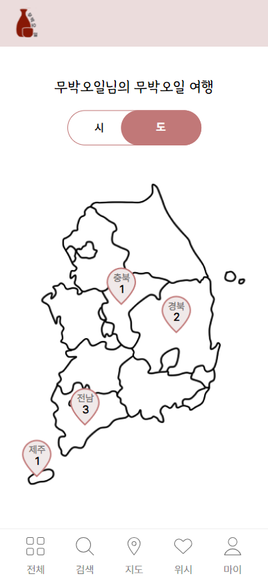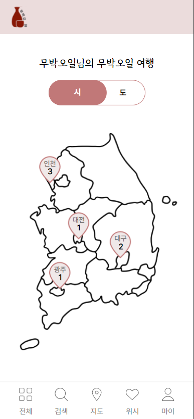
 
 

> 나의 위시리스트 & 마이페이지

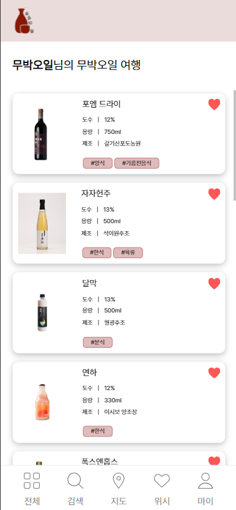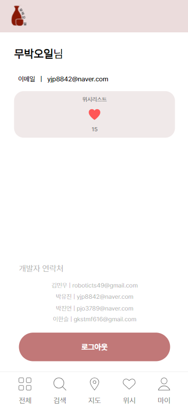